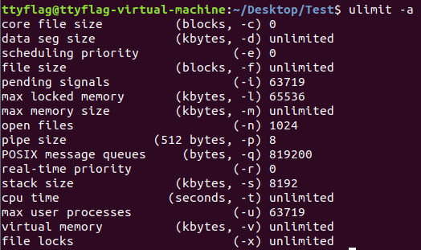

# GDB INSTRUCTIONS

## 启动调试
1. gdb filename
2. gdb attach pid
   - 可以调试正在运行的程序
3. gdb filename corename
   - 首先查看linux是否开启了在程序崩溃时生成core文件选项
   - ulimit
     - -a 查看各种限制大小
     
          
     - -c 查看是否开启
     - -c (n) 指定core file max size(KB)，n可以替换成unlimited
       - 仅限当前终端，为了永久生效有两个途径：
         1. 在 `/etc/security/limits.conf` 中增加一行
            ```
                #<domain> <type> <item> <value>
                * soft core unlimited 
            ```
         2. 把指令写到`/etc/profile |  ~/.bashrc | ~/.bash_profile`中去
   - 生成的core文件的默认命名方式是：core.pid，与崩溃程序同目录
     - pid不易区分，用以下函数在程序开始时记录自己的pid
        ```c++
        void writePid() { 
            uint32_t curPid = (uint32_t) getpid(); 
            FILE* f = fopen("xxserver.pid", "w"); 
            assert(f); 
            char szPid[32]; 
            snprintf(szPid, sizeof(szPid), "%d", curPid); 
            fwrite(szPid, strlen(szPid), 1, f); 
            fclose(f); 
        }
        ``` 
    - `/proc/sys/kernel/core_uses_pid`为1允许自定义core file文件名，`/proc/sys/kernel/core_pattern`保存命名规则

        

## run
- 简写为r，从头开始运行程序

## step
- 简写为s，逐行调试，单步跳入
- si，逐指令调试

## next
- 简写为n，逐行调试，单步跳过（不进入函数）

## finish
- 执行当前函数到正常退出并回到上一层调用处  

## return
- 立即结束执行当前函数并返回
- 还可以指定返回值
 
## until
- 简写为u，指定程序运行到某一行停下来
- 基本等同于先打断点再运行到该处，当断点多的时候比较好控制

## jump
- 简写为j，后面跟行号或者函数地址
- 直接跳到该位置去，省略中间的执行，可以调试控制流
- 危险慎用

## continue
- 简写为c，继续运行程序

## break
- 简写为b，为某个位置打永久断点
- b functionname，在某个函数入口处打断点
  - 如果有多个重名函数，会全部打上断点，为了区分需要用命名空间前缀
- b lineNo，在当前文件某个行号打断点
- b filename:lineNo，在某个文件的某一行打断点
- 上述指定断点位置后还可以跟条件表达式，比如if x != 0
- tbreak，临时断点，简写为tb，和b用法一样
- info break，简写为info b
  - 可以查看所有断点信息，每个断点对应一个序号n
  - disable n1 (n2 ...)， enable n分别弃用、启用断点
  - delete n，删除断点，不指定n代表全删


## backtrace
- 简写为bt，查看当前线程的调用堆栈
- 每个堆栈前面会有编号n，使用frame n可以切换到对应的堆栈
  
## list
- 简写l，查看当前位置附近的代码，前后各10行
- l -，可以往上显示10行
- l +，可以往下显示10行
- 源文件的位置必须和编译时一样，因为可执行文件不包含源码
- 如果位置发生了变动，使用`dir path1:path2:path3...`指定源码的位置
- 单用`dir`命令可以清除附加的目录

## print
- 简写为p，后面跟当前栈帧变量名或表达式，打印该值
- p /format varname，可以按一定格式打印
  
  

## ptype
- 列出该变量的类型和各个成员的字段名

  

## watch
- 用来监视一个变量或者一段内存，当这个变量或者该内存处的值发送变化时，gdb 就会中断下来

## display
- 监视的变量或者内存地址，每次程序中断下来都会自动输出这些变量或内存的值

## set

## detach
- 让程序与 gdb 调试器分离，程序继续运行

## notices
- gdb不输入指令按enter默认执行上一条指令
- 一些系统库（如libc.so）没有调试信息
- 


1. 单击悬浮球输入消息，输入完毕自动把消息复制到粘贴板/vx窗口
2. 复制加密内容，粘贴到悬浮球解密
3. 为不同的联系人保存密钥对
4. 支持更换算法
5. 支持图片