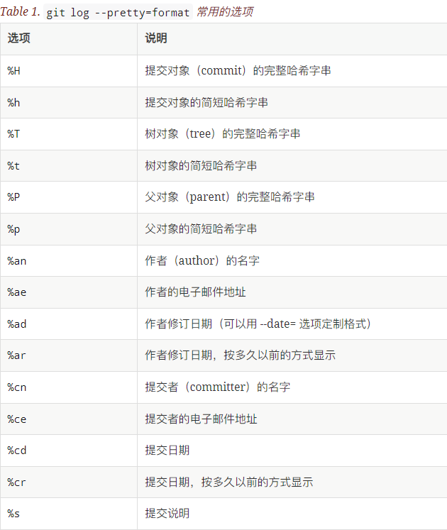

## status
- 查看哪些文件
- -s可以查看简短模式
  - 新添加的未跟踪文件前面有 ?? 标记
  - 新添加到暂存区中的文件前面有 A 标记
  - 修改过的文件前面有 M 标记，M 有两个可以出现的位置，出现在右边的 M 表示该文件被修改了但是还没放入暂存区，出现在靠左边的 M 表示该文件被修改了并放入了暂存区
  - 需要移除的文件前面有 D 标记
  - 重命名的文件前面有 R 标记
    ```
    $ git status -s
    M README
    MM Rakefile
    A  lib/git.rb
    M  lib/simplegit.rb
    ?? LICENSE.txt
    ```
## add
- 这是个多功能命令：可以用它开始跟踪新文件，或者把已跟踪的文件放到暂存区，还能用于合并时把有冲突的文件标记为已解决状态等。
-  将这个命令理解为“添加内容到下一次提交中”而不是“将一个文件添加到项目中”要更加合适。
## .gitignore
- 可以在项目根目录用`touch .gitignore`创建
  - 形如1.gitignore的文件名不起作用
- 该文件可以指定git忽略某些文件，常见的[模板链接](https://github.com/github/gitignore)
- 所有空行或者以 ＃ 开头的行都会被 Git 忽略
- 可以使用标准的 glob 模式匹配
- 匹配模式可以以（/）开头防止递归
- 匹配模式可以以（/）结尾指定目录
- 要忽略指定模式以外的文件或目录，可以在模式前加上惊叹号（!）取反
## diff
- 此命令比较的是工作目录中当前文件和暂存区域快照之间的差异， 也就是修改之后还没有暂存起来的变化内容
- 会根据上次修改**时间**判断是否进行了修改
- --staged 和 --cached 是同义词
## commit
- 这种方式会启动文本编辑器以便输入本次提交的说明
  - 使用` git config --global core.editor `命令设定默认编辑器
- -m可以直接在后面键入提交说明
- -a可以跳过使用暂存区域，Git会自动把所有已经跟踪过的文件暂存起来一并提交
- --amend可以修正之前的提交，你可以额外add一些文件或者delete一些，然后amend，该次提交会覆盖上次提交
  - 如果自上次提交以来你还未做任何修改（例如，在上次提交后马上执行了此命令），那么快照会保持不变，而你所修改的只是提交信息
## rm
- 该指令会同时把文件从工作区和暂存区移除
- 先从已跟踪文件清单中移除，这样下次commit就不会包括该文件
- --cached可以把文件保留在工作区，仅从暂存区移除
- 如果一个暂存了的文件被修改了，则只能-f强制移除或者--cached仅从暂存区移除
## mv
- 用法：`$ git mv file_from file_to`
- 可以用于重命名
  - 如果手动重命名一个被追踪的文件，git会认为这是先delete然后写了个新的
## log
- 按提交时间列出所有的更新，最近的更新排在最上面，列出每个提交的 SHA-1 校验和、作者的名字和电子邮件地址、提交时间以及提交说明
  ```
  $ git log
  commit ca82a6dff817ec66f44342007202690a93763949
  Author: Scott Chacon <schacon@gee-mail.com>
  Date:   Mon Mar 17 21:52:11 2008 -0700

      changed the version number

  commit 085bb3bcb608e1e8451d4b2432f8ecbe6306e7e7
  Author: Scott Chacon <schacon@gee-mail.com>
  Date:   Sat Mar 15 16:40:33 2008 -0700

      removed unnecessary test

  commit a11bef06a3f659402fe7563abf99ad00de2209e6
  Author: Scott Chacon <schacon@gee-mail.com>
  Date:   Sat Mar 15 10:31:28 2008 -0700

      first commit
  ```
- -p可以显示每次提交的内容差异
- -(n)可以显示最近n次commit
- --stat显示每次提交的简略的统计信息
- --shortstat只显示 --stat 中最后的行数修改添加移除统计
- --name
  - -only仅在提交信息后显示已修改的文件清单
  - -status显示新增、修改、删除的文件清单
- --abbrev
  - -commit仅显示 SHA-1 的前几个字符，而非所有的 40 个字符
- --graph显示 ASCII 图形表示的分支合并历史
- --pretty使用其他格式显示历史提交信息。可用的选项包括 oneline，short，full，fuller 和 format（后跟指定格式
  - 示例
    ```
    $ git log --pretty=format:"%h - %an, %ar : %s"
    ca82a6d - Scott Chacon, 6 years ago : changed the version number
    085bb3b - Scott Chacon, 6 years ago : removed unnecessary test
    a11bef0 - Scott Chacon, 6 years ago : first commit
    ```
    
- --since, --after仅显示指定时间之后的提交。
- --until, --before仅显示指定时间之前的提交。
- --author仅显示指定作者相关的提交。
- --committer仅显示指定提交者相关的提交。
- --grep仅显示含指定关键字的提交
- -S仅显示添加或移除了某个关键字的提交
## remote
- 该关键字用于操纵远程仓库，后面一般加上shortname
- add，`git remote add <shortname> <url>`新增一个远程仓库
  - 其中shortname用于指代后面的url，后面可以用其代替url以简写
  - 默认的shortname是origin
- show查看某一个远程仓库的更多信息
- rename可以重命名
- rm可以移除远程仓库
## fetch
- 会将数据拉取到你的本地仓库 - 它并不会自动合并或修改你当前的工作。 当准备好时你必须手动将其合并入你的工作
- 这么做比直接pull安全
## push
- `git push [remote-name] [branch-name]`
- 只有当你有所克隆服务器的写入权限，并且之前没有人推送过时，这条命令才能生效。 
- 当你和其他人在同一时间克隆，他们先推送然后你再推送，你的推送就会被拒绝。 你必须先将他们的工作pull下来并将其merge进你的工作后才能推送。
  - 也就是push之前必须保证你的仓库同步了远程仓库的最新信息
## tag
- 给仓库历史中的某一个提交打上标签, 比较有代表性的是人们会使用这个功能来标记发布结点（ v1.0 、 v2.0 等等）
- Git 使用两种主要类型的标签：轻量标签（lightweight）与附注标签（annotated）
  - 轻量标签很像一个不会改变的分支 ,它只是一个特定提交的引用
- -a附注标签是存储在 Git 数据库中的一个完整对象。 它们是可以被校验的；其中包含打标签者的名字、电子邮件地址、日期时间；还有一个标签信息；并且可以使用 GNU Privacy Guard （GPG）签名与验证
- -d删除指定标签（不会删除对应commit）
## alias
- 别名可以简化你的一些操作
- 示例
  ```
  $ git config --global alias.co checkout
  $ git config --global alias.br branch
  $ git config --global alias.ci commit
  $ git config --global alias.st status
  ```
  以上代码用co代表checkout，其余同理
- 你可以用'xxx'代替上面的checkout，其中xxx是一串指令，这样可以保存你常用的指令串
## notice
- github中新建的仓库会把主分支命名为main，git则会命名为master